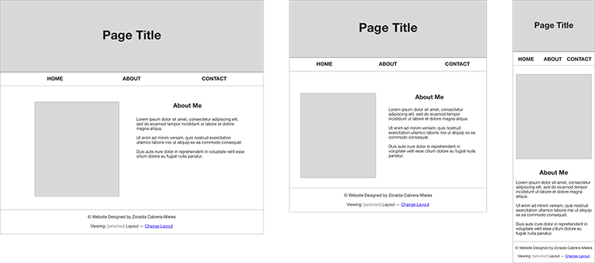

# Responsive Layout 3 Ways
This project explores three different ways of creating a responsive CSS layout. The same 3-page website is coded using:

- Floats
- Felxbox 
- Grid

## Responsive Images
Shared styless are kept under a `main.css` file, which also sets a responsive image as the background of the page's `<header>` (see `css/main.css` lines 132-152). Each layout also uses the HTML `<picutre>` tag to define responsive images within the page's HTML structure.

## Nested Layouts
I created a three column layout that nested within another three column layout. The nested layout maintains a consistent structure, even in smaller devices. 

- Float Nesting: `floats\index.html` lines 38 and`css/floats.css` lines 31-45
- Flexbox Nesting: `flexbox\index.html` lines 34 and`css/flexbox.css` lines 24-36
- Grid Nesting: `grid\index.html` lines 41 and 56 and`css/grid.css` line 20

## Reordering
I also show an example of reordering columns with each layout.

- Float Reordering: `floats\index.html` lines 30 and 85 and`css/floats.css` lines 89 and 94
- Flexbox Reordering: `flexbox\index.html` lines 80 and`css/flexbox.css` line 62
- Grid Reordering: `grid\index.html` line 66 and`css/grid.css` line 44

## Page Mockups (Desktop, Tablet, and Mobile)

### Home Page

### About Page

### Contact Page
 

 
